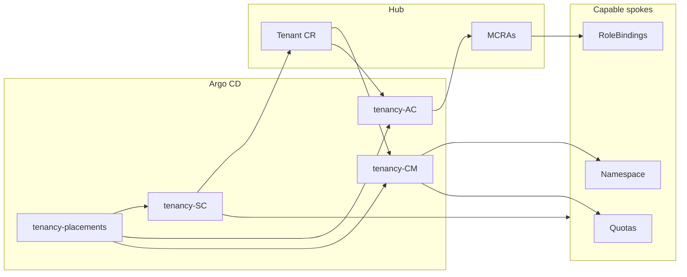

# Placements and PolicySets cheat sheet

This guide explains **which Argo CD applications deploy what**, how **Placements**
choose clusters, and how **PolicySets** map to hub vs spoke resources.

For day-to-day tenant onboarding, see [new-tenant.md](new-tenant.md). For the
broader tenancy model, see [tenancy-model.md](tenancy-model.md).

---

## Two layers of targeting

1. **Cluster capability labels** — which spokes participate in tenancy at all, and
   for containers vs VMs.
2. **Tenant `spec.workloadProfile`** (`vms` | `containers` | `both`; default `vms`)
   — what each tenant receives on capable clusters.

Placements handle layer 1. Workload profile gates the policy templates in layer 2.

| Label | Meaning |
|-------|---------|
| `tenancy.acm.io/capability-container=true` | Spoke can host container/application workloads |
| `tenancy.acm.io/capability-vm=true` | Spoke runs OpenShift Virtualization (CNV) |

Label clusters before creating tenants. See
[placements/capabilities/README.md](../placements/capabilities/README.md).

---

## Argo CD applications

| Argo app | Git path | Delivers |
|----------|----------|----------|
| `tenancy-placements` | `placements/` | Placement rules (cluster selectors) |
| `tenancy-base` | `tenancies/` | Optional GitOps-managed Tenant CRs (empty by default) |
| `tenancy-system-and-communications-protection` | `policygen/SC-…` | Tenant CRD + Tenant CR replication |
| `tenancy-access-control` | `policygen/AC-…` | RBAC (hub + spoke) |
| `tenancy-configuration-management` | `policygen/CM-…` | Namespaces, quotas, network, MetalLB |

Apply order: **placements** → **SC** (CRD) → **AC** + **CM**.

---

## Placement rules

| Placement name | Namespace | Selects |
|----------------|-----------|---------|
| `policies-placement-hub-clusters` | `policies` | Hub (`local-cluster`) |
| `policies-placement-managed-clusters` | `policies` | `capability-container` **or** `capability-vm` |
| `policies-placement-managed-vm-clusters` | `policies` | `capability-vm` only |
| `tenancies-placement-hub-clusters` | `tenancies` | Hub |
| `tenancies-placement-managed-clusters` | `tenancies` | Same OR rule as managed policies |

ACM treats multiple predicates as **OR**: a spoke needs **at least one** capability
label to match the managed placements.

---

## PolicySets → placement → resources

### Hub (`local-cluster`)

| PolicySet | Argo app | Placement | Policies | Purpose |
|-----------|----------|-----------|----------|---------|
| `tenancy-hub-tenant-definition` | SC | `tenancies-placement-hub-clusters` | `tenancy-hub-tenant-crd` | Tenant CRD + `tenancies` namespace |
| | | | `tenancy-hub-keycloak-realms` | Keycloak realms (`manageRealm: true`) |
| | | | `tenancy-hub-identity-reconciler` | OpenShift OAuth IdP registration |
| `tenancy-hub-access-control` | AC | `policies-placement-hub-clusters` | `tenancy-hub-console-and-vm-rbac` | Hub CRBs + MCRAs |
| `tenancy-hub-configuration` | CM | `policies-placement-hub-clusters` | `tenancy-hub-console-perspective-visibility` | Console perspective RBAC |

### Spokes — general / container (`capability-container` OR `capability-vm`)

| PolicySet | Argo app | Placement | Policies | Purpose |
|-----------|----------|-----------|----------|---------|
| `tenancy-managed-tenant-definition` | SC | `tenancies-placement-managed-clusters` | `tenancy-managed-tenant-crd` | Tenant CRD on spoke |
| | | | `tenancy-managed-tenant-replication` | Replicate Tenant CRs hub → spoke |
| `tenancy-managed-access-control` | AC | `policies-placement-managed-clusters` | `tenancy-managed-custom-clusterroles` | `tenant-ns:*` ClusterRoles |
| `tenancy-managed-configuration` | CM | `policies-placement-managed-clusters` | `tenancy-managed-admin-network-policy` | Cross-tenant network deny |
| | | | `tenancy-managed-namespaces` | Namespace (`containers` / `both`) |
| | | | `tenancy-managed-quotas` | ResourceQuota + LimitRange (no AAQ) |
| | | | `tenancy-managed-udn-network` | UserDefinedNetwork |
| | | | `tenancy-managed-metallb-bgp` | MetalLB BGP/VRF |

### Spokes — VM only (`capability-vm`)

| PolicySet | Argo app | Placement | Policies | Purpose |
|-----------|----------|-----------|----------|---------|
| `tenancy-managed-vm-configuration` | CM | `policies-placement-managed-vm-clusters` | `tenancy-managed-vm-namespaces` | Namespace (`vms` / `both`) |
| | | | `tenancy-managed-vm-quotas` | ResourceQuota + AAQ + LimitRange |
| | | | `tenancy-managed-vm-udn-network` | UDN on VM clusters |
| | | | `tenancy-managed-vm-metallb-bgp` | MetalLB on VM clusters |

---

## MCRAs: hub policy, spoke effect

`tenancy-hub-console-and-vm-rbac` runs on the **hub**, but each MCRA
`clusterSelection` targets a **spoke placement**:

| MCRA role | Spoke placement | Workload profile |
|-----------|-----------------|------------------|
| `kubevirt.io:admin/edit/view` | `policies-placement-managed-vm-clusters` | `vms`, `both` |
| `acm-vm-extended:admin/view` | `policies-placement-managed-vm-clusters` | `vms`, `both` |
| `tenant-ns:admin/user/viewer` | `policies-placement-managed-clusters` | `containers`, `both` |
| `tenant-ns:admin/user/viewer` | `policies-placement-managed-vm-clusters` | `vms`, `both` |

Hub `ClusterRoleBinding` for `acm-vm-fleet:view` is hub-only, gated to `vms` /
`both`.

---

## Workload profile vs placement

| Tenant `workloadProfile` | Managed placement (CM) | VM placement (CM) |
|--------------------------|------------------------|-------------------|
| `vms` (default) | — | namespaces, quotas (+AAQ), UDN, MetalLB |
| `containers` | namespaces, quotas, UDN, MetalLB | — |
| `both` | container side | VM side |

---

## Policy dependency chain

```
tenancy-hub-tenant-crd                 (hub — CRD must exist first)
        ↓
tenancy-managed-tenant-crd             (spoke — CRD on spokes)
        ↓
tenancy-managed-tenant-replication
        ↓
tenancy-managed-namespaces
tenancy-managed-vm-namespaces
        ↓
quotas → udn → metallb
```

CM policies depend on `tenancy-managed-tenant-replication` being **Compliant**
before creating namespaces.

---

## End-to-end flow



1. **Placements** define which clusters are in scope.
2. **SC** installs the CRD and replicates Tenant CRs to spokes.
3. **CM** reads Tenant CRs and creates namespaces, quotas, and network.
4. **AC** deploys ClusterRoles on spokes and MCRAs on the hub to bind IdP groups.

---

## Quick lookup: change X → edit Y

| Goal | Where to look |
|------|----------------|
| Which clusters get tenants | `placements/` + cluster capability labels |
| Namespace / quota defaults | Tenant CRD + `quota/quotas-from-crd*.yaml` |
| Who can manage VMs | `acm-finegrained-rbac/hub-mcra-virt.yaml` |
| Console menu for tenants | `console/policy-console-perspective-rbac.yaml` |
| Keycloak realm behaviour | `keycloak/realm-import-from-crd.yaml` |
| Container vs VM provisioning | `spec.workloadProfile` + CM policy templates |

---

## Legacy placements

Inactive by default; switch via `placements/policies/kustomization.yaml`:

| File | Selects |
|------|---------|
| `placement-managed.yaml` | All spokes except hub |
| `placement-managed-by-label.yaml` | `tenant-eligible=true` |
| `placement-managed-by-clusterset.yaml` | Named `ManagedClusterSet` |

Capability-based placements are preferred: one cluster can support containers,
VMs, or both without splitting fleet membership.
